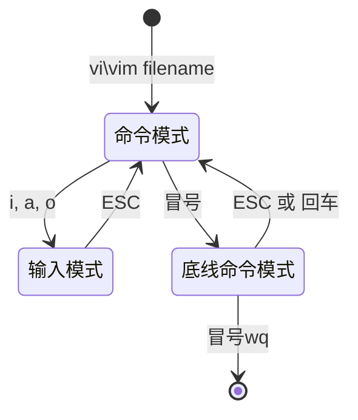

## 1. Linux 命令

### 1.1. 1-1 命令基础

1 命令行

Linux终端, 命令指示符界面。使用各种字符化命令对操作系统发出操作指令。

2 命令

Linux程序。一个命令就是一个程序, 一般不通过图形化界面操作, 在命令行提供字符化反馈。

3 命令基础格式

```shell
command [-options] [parameter]
```

+ `command`：命令
+ `-options`: [可选, 非必填]操作, 通过选项控制命令的行为细节
+ `parameter`: [可选, 非必填]参数, 多用于命令指向目标
+ `[]`: 表示该选项为可选选项

### 1.2. 1-2 ls 命令

1 作用: 列出目录下内容

> 没有指定任何选项和参数的`ls`命令的作用为：以平铺形式列出当前工作目录下的内容

2 语法

```shell
ls [-a -l -h] [Linux路径]
```

+ `-a`: all的意思, 将当前工作目录中所有文件列出(包括隐藏文件/文件夹)
  + 在列出文件中, 开头有`.`的文件/文件夹为隐藏文件/文件夹
  + 隐藏文件/文件夹只能通过`-a`展示出来
+ `-l`: list的意思, 以列表(竖向)的形式展示文件信息, 并展示文件更多信息(包括文件权限、用户和用户组、文件大小以及创建时间等)
+ `-h`: 必须和`-l`选项组合使用。使列表展示信息中文件大小信息, 以易于阅读的方式列出(会带上单位，如K、M、Ｇ等)。
+ `[Linux路径]`: 为`ls`命令的参数, 是`ls`命令的指向目标。换句话说, 就是对哪个工作目录使用`ls`命令。
+ `[]`: 表示该选项为可选选项

3 选项组合使用

如：

```shell
ls -a -l /
ls -al /
ls -la /
```

上述三种命令为相同作用

4 HOME目录和工作目录

+ HOME目录:
  + 每一个Linux操作用户在Linux系统下的个人账户目录, 路径为: `/home/用户名`
  + 在左边显示的路径为`~`
+ 工作目录:
  + Linux终端在执行命令的时候需要一个工作目录
  + 当终端在Linux加载的时候, 会默认将HOME目录设置为当前工作目录
  + 当前工作目录, 就是目前操作的目录, 也就是左边显示的路径目录

### 1.3. 1-3 cd-pwd

#### 1.3.1. cd 命令

1 作用: 更改当前所在的工作目录

cd change directory

2 语法

```shell
cd [Linux路径]
```

+ 没有选项, 只有参数, 表示切换到哪个目录
+ 没有写参数时, 默认参数为HOME目录。也就是说, `cd`命令将会将当前目录切换为HOME目录

#### 1.3.2. pwd 命令

1 作用: 查看当前所在的工作目录

pwd print work directory

2 语法

```shell
pwd
```

+ pwd 命令没有选项和参数

### 1.4. 1-4 相对路径、绝对路径和特殊路径表示符

#### 1.4.1. 相对路径

以**当前目录**为起点, 路径描述以当前工作目录内的文件/文件夹为起点

#### 1.4.2. 绝对路径

以**根目录**为起点, 路径描述以`/`开头

#### 1.4.3. 特殊路径表示符号

+ `.`：表示当前工作目录
+ `..`：表示上一级目录
+ `~`: 表示HOME目录

### 1.5. 1-5 mkdir

1 作用

创建新的目录(文件夹)

mkdir make directory

2 语法

```shell
mkdir [-p] Linux路径
```

+ `[-p]`: [可选]表示创建Linux目录时,若其父目录不存在,则自动创建,适用于创建连续多层级目录。
+ 参数必填, 表示要创建的Linux目录路径,相对路径和绝对路径均可,路径表示符也可以使用。

### 1.6. 1-6 touch、cat、more

#### 1.6.1. touch

作用：创建文件

语法:

```shell
touch Linux路径
```

+ 参数必填

> 在文件/目录权限中，文件权限的第一位是`_`，目录权限的第一位是`d`。

#### 1.6.2. cat

作用：查看文件内容，将文件内容在一切全部展示出来

语法：

```shell
cat Linux路径
```

+ 参数必填

#### 1.6.3. more

作用：查看文件内容，当文件内容过多的时候，文件将会分页展示

```shell
more Linux路径
```

+ 参数必填
+ 空格翻页
+ 按`q`退出

### 1.7. 1-7 cp、mv、rm

#### 1.7.1. cp

作用：复制文件\目录

cp copy

语法：

```shell
cp [-r] 参数1　参数2
```

+ `[-r]`: 可选操作。用于复制文件夹，表示递归
+ 参数1: Linux路径，表示被复制对象
+ 参数2: Linux路径，表示复制后存放的地方

#### 1.7.2. mv

作用：移动文件\目录

mv move

语法：

```shell
mv 参数１　参数２
```

+ 参数1: Linux路径，表示被移动的文件\目录
+ 参数2: Linux路径，表示移动到的目录路径

#### 1.7.3. rm

作用：删除文件、目录

rm remove

语法：

```shell
rm [-f -r] 参数1[ 参数2[ ...]]
```

+ 默认删除文件
+ `[-r]`：可选，用于删除目录
+ `[-f]`：可选，force，表示强制删除
+ 参数：表示要被删除的文件\目录路径，以空格隔开

rm 命令支持通配符`*`

+ `string*`
+ `*string`
+ `*string*`

`-f`：强制删除，也可以认为是直接删除。通常，普通用户删除文件时不会给出提示，而root用户由于权限过大，删除文件时会跳出是否删除文件的提示，而`-f`往往用于root用户忽略提示。

> rm　命令是危险命令，尤其在root用户下，谨慎使用。
>
> 如下两条命令，严禁在root管理员用户下执行：
>
> + `rm -rf /`
> + `rm -rf /*`
>
> 作用为清空系统

### 1.8. 1-8 which－find

#### 1.8.1. which

作用：查找命令的程序文件存放位置

语法：

```shell
which 命令
```

#### 1.8.2. find

作用：查找指定文件

语法：

1 根据文件名查找

  ```shell
  find 参数1 -name 参数2
  ```

+ `参数1`: 起始路径
+ `-name`: 根据姓名查找
+ `参数2`: 被查找文件名, 用双括号包裹, 支持通配符`*`模糊查询

2 根据文件大小查找

  ```shell
  find 参数1 -size 参数2
  ```

+ `参数1`: 起始路径
+ `-size`: 根据文件大小查找
+ `参数2`: 被查找文件大小, 格式为`+|-n[kMG]`
  + `{+, -}`: 表示{大于, 小于}
  + `n`: 数值
  + `[kMG]`: 内存单位, 有k(小写)、M、G三个，分别对应为KB、MB、 GB

  > 查看文件大小 `ls -lh`
  > 第一个k是小写, 后续的M、G是大写

### 1.9. 1-9 grep-wc和管道符

#### 1.9.1. grep

作用: 用于查找文件中符合条件的文件行

语法:

```shell
grep [-options] 参数1 参数2
```

`[options]`: 可选

+ `-n`: number 显示匹配行的行号
+ `-i`: ignore 忽略大小写
+ `-v`: reverse 反向查找, 只打印不匹配的行
+ `-r`: recursion 递归查找
+ `-l`: list 只打印匹配的文件名
+ `-c`: count 只打印匹配的行数

参数:

+ 参数1: 表示要查找的字符串或者正则表达式
  + 带有空格或其它特殊符号时, 建议使用`""`将关键字包裹起来
+ 参数2: 文件路径, 表示要查找的文件名,
  + 可以同时查找多个文件
  + 不指定文件路径, 或者文件路径指定为 `_` ,则从标准输入设备读取数据

#### 1.9.2. wc

作用: 计算文件的Bytes数、字数、列数

语法:

```shell
wc [-clwm] [--help] [--version] 参数
```

`[options]`:

+ `-c --bytes --chars`: 统计Bytes数
+ `-m`: 统计字符数
+ `-l --lines`: 统计行数
+ `-w --words`: 统计字数
+ `--help`: 帮助信息
+ `--version`: 显示版本信息

> 在默认的情况下, `wc` 将计算指定文件的行数、字数, 以及字节数。

参数: 文件路径

+ 可以同时统计多个文件的信息
+ 不指定文件名称, 或者指定文件路径为`_`, 则 `wc` 指令会从标准输入设备读取数据

#### 1.9.3. 管道符|

作用: 是一个元符号 `|`, 通过连接多个命令，并将管道左边命令的标准输出作为符号右边命令的标准输入

语法:

```shell
command1 | command2 | command3 | ...
```

+ command1 的标准输出将作为command2 的标准输入, 以此类推

常用用法:

1. 过滤输出

	```shell
    # 列出当前目录下以`.txt`结尾的文件
    ls | grep "\.txt$"
    ```

2. 排序去重

	```shell
    
    ```

3. 统计字数

	```shell
    # 统计 logfile.txt 中包含 “ERROR” 的行数
    grep "ERROR" logfile.txt | wc -l

    # /usr/bin 统计目录中文件行数
    ls -l /usr/bin | wc -l
    ```

4. 按大小排序文件

	```shell
    # 
    ```

5. 数据转换

	```shell

    ```

6. 查找与显示进程

	```shell

    ```

### 1.10. 1-10 echo

#### 1.10.1. echo

作用: 字符串的输出

格式:

```shell
echo 参数
```

+ `参数`: string, 使用`""`包裹

#### 1.10.2. 反引号

终端中被反引号(飘号)包裹的字符串会作为命令被执行

```shell
#　示例
echo `pwd` # 输出pwd命令查询到的结果
echo pwd   # 输出字符串pwd
```

#### 1.10.3. 重定向符

`>`

作用: 将左侧命令的结果, **覆盖**写到符号右侧的文件中

语法：

```shell
command1 > 参数2
```

+ command1: 命令
+ `参数2`: 文件路径

`>>`

作用: 将左侧命令的结果, **追加**写到符号右侧的文件中

语法:

```shell
command1 >> 参数2
```

+ command1: 命令
+ `参数2`: 文件路径

#### 1.10.4. tail

作用: 查看文件尾部内容

语法:

```shell
tail [options] 参数
```

`[options]`:可选

+ `-f`: 持续跟踪文件更改
  + 永久跟踪, 不会自动停止, 只能手动打断, 比如使用快捷键 ctrl + c
+ `-n`: 表示查看尾部行数, 比如`-20`, 则是查看尾部20行内容
  + 默认查看尾部 10 行内容

### 1.11. 1-11 i\vim编辑器

三种输入模式:

1. 命令模式
2. 输入模式
3. 底线命令模式



#### 1.11.1. 命令模式

启动vi\vim编辑器时,　默认进入到命令模式中, 该模式下输入的字符命令对文本进行编辑

语法:

```shell
vim 参数
```

+ 参数: 文件路径
  + 如果该文件存在, 则打开文件并编辑
  + 如果该文件不存在, 则新建文件并编辑

常用命令:

1. 进入输入模式的指令

	 + `i`: 切换到输入模式, 在光标当前位置开始输入文本
	 + `I`: 切换到输入模式, 在光标当前行开头位置开始输入文本
	 + `x`: 删除当前光标所在字符
	 + `a`: 切换到输入模式, 在光标下一位置开始输入文本
	 + `A`: 切换到输入模式, 在光标当前行结尾位置开始输入文本
	 + `o`: 在当前行的下方插入一个新行，并进入输入模式
	 + `O`: 在当前行的上方插入一个新行，并进入输入模式

2. 进入到底线命令模式

	  + `:`: 切换到底线命令模式

3. 光标移动指令

	  + `上下左右, kjhl`: 上下左右移动光标
	  + `0`: 光标移动到当前行的开头
	  + `$`: 光标移动到当前行的结尾
	  + `pageup`: 上一页
	  + `pagedown`: 下一页
	  + `gg`: 光标移动到文件开始
	  + `G`: 光标移动到

4. 搜索模式

	+ `/string`: 进入搜索模式, 并搜索 string
	+ `n`: 在搜索模式中, 对搜索结果向下继续搜索
	+ `N`: 向上继续搜索

5. 编辑指令

   + `dd`: 剪切当前行
   + `ndd`: 从当前行开始的向下n行文本将会被剪切
   + `d0`: 从光标当前位置到行开头的内容全部删除
   + `d$`: 从光标当前位置到行结尾的内容全部删除
   + `dgg`: 从当前行开始到行首的内容全部被删除
   + `dG`: 从当前行开始到行尾的内容全部被删除
   + `yy`: 复制当前行
   + `p`: 粘贴剪贴板内容到光标下方
   + `P`(大写): 粘贴剪贴板内容到光标上方
   + `u`: 撤销上一次操作
   + `ctrl + r`: 重做上一次撤销的操作

#### 1.11.2. 输入模式

命令模式下按键盘上的字母`i`, 可进入输入模式

输入模式下按键盘上按键`esc`, 可切换到命令模式

#### 1.11.3. 底线命令模式

命令模式下按键盘上的字符`:`, 切换到底线命令模式, 通过输入命令对文件编辑

底线命令模式下, 按`esc`切换到命令模式

常用命令:

+ `:w`: write 写入文件
+ `:q`: quit 退出文件
+ `:wq`: 保存并退出
+ `:q!`: 强制退出, 在底线命令模式中, `!`表示强制
+ `:set nu`: 显示行号
+ `:set paste`: 设置粘贴模式

### 1.12. 1-12 文件链接

概念:

链接是对另一个文件的引用链接为同一文件提供多个名称，并允许它们同时存在于两个或多个位置。

语法:

```shell
ln [options] 参数1 参数2
```

`options`:

+ `[-s]`: soft, 是否启用文件软链接
	+ 不使用`-s`, 默认创建文件硬链接
	+ 使用`-s`, 创建文件软链接

参数:

+ 参数1: 源文件\\目录路径
+ 参数2: 目标文件\\目录路径

> 生成的软链接文件在通过命令`ls -l`查看时，其权限信息部分第一位为`l`
